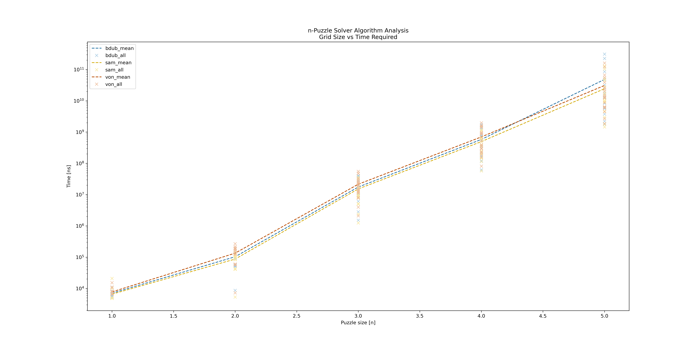
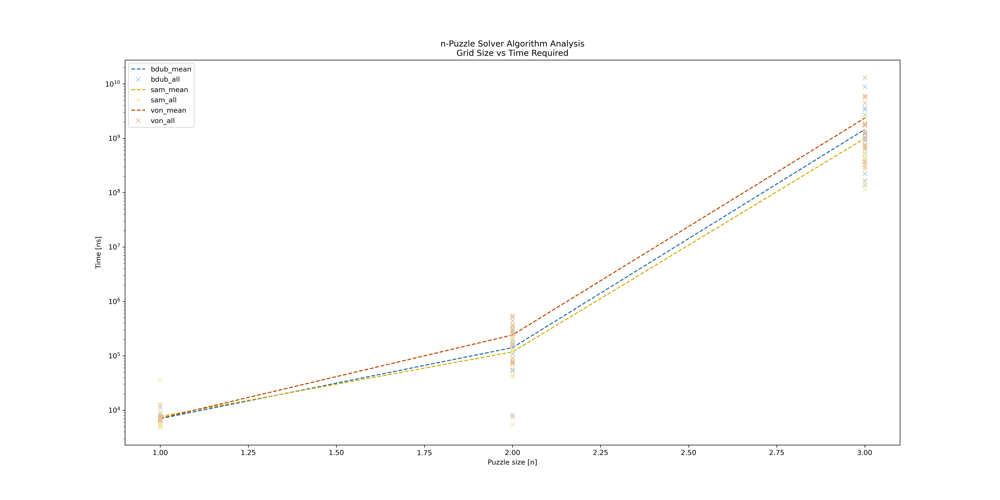

# BSV_15

15 Puzzle Branch & Bound
***
## Description

Our program starts by giving the user three options: 
1. Launch GUI
2. Plot Timing Data
3. Import Test Puzzle 

**Option 1** 
The program will open a graphical user interface to display a randomized solvable 15 puzzle. 
The user can then move around puzzle pieces, while the program increments and displays the total moves taken. 
The GUI also contains the following menu buttons: 
 * "Solve" Button
   * Starts a new thread to find a solution path for the puzzle. 
     Once this thread has completed, the GUI will display the moves taken to get to the solution while incrementing the total moves counter for each move taken.
 * "Reset" Button
   * Resets the board back to its initial state and resets the move counter to zero.
 * "New Board" Button
   * Generates a new randomized solvable puzzle and draws it to the screen.
 * "Board Size" Text Box
   * Allows the user to type in a new board width.
     When "New Board" is clicked again after this, a puzzle of the new width will be generated and drawn.

 When the user wants to close the GUI, they can press Esc or click the OS close button.

**Option 2**  
The user is prompted to enter the minimum puzzle size, maximum puzzle size, and number of tests per puzzle size. 
After the user input, our program will begin solving puzzles from the minimum size to the maximum size. 
The program will generate and solve a number of puzzles equal to the user input number of tests for each size. 
Upon completion of the tests, the results will be saved in a CSV file.  
To visualize the experimental data, the program creates two plots: 
one plot for the individual’s data, and another plot that compares their individual data with each group member’s data. 
When running this Program as a new user, it will automatically compare the data to our group members data and plot it. 

**Option 3**  
The user is prompted to enter a file path that contains a pre-generated puzzle and the desired number of tests. 
The program then imports the puzzle and solves it the desired number of times, recording the time taken to solve each puzzle. 
Upon completion, the average time to solve the given puzzle is displayed.

 
When considering a cost function to compare board states, we chose to only use the number of misplaced non-blank tiles.
If two tiles have the same cost (tiles out of place), then our program compares the number of inversions of each node and selects the node with fewer inversions.
As a result of this cost function, our program does not find the optimal solution.
This was a design choice, as finding the optimal solution takes significantly more time than simply finding a solution.
To find the optimal solution, we must add the depth of the node into the cost.
Doing this causes our main algorithm to do a breadth-first search amongst the state tree.
For well randomized puzzles, this forces the algorithm to search through an excessive number of board states before finding moves that reduce the cost.

***
## Test Result Analysis

Below is a graph containing a comparison of our group's times for solving puzzles with grid width 1 through 5 testing each width 20 times.
Each group member used the same seed to generate puzzles.
The x-axis has the grid width plotted linearly, and the y-axis has the time-required to solve in nanoseconds plotted logarithmically. 
The graph contains points for each individual test run, as well as a line plotting the mean time for each size.

When analyzing the graph, incrementing the grid width drastically increases the time it takes to solve the puzzle. 
This is clear when looking at the algorithm to solve a puzzle and the time complexity.  
The time complexity for solving a puzzle with branch and bound is O (n^2 * n!) where n is the grid width of the given puzzle. 
Looking at the time complexity, it is easy to see how increasing n drastically increases the time to solve the (n^2)-1 puzzle.

Below is a graph for finding optimal solutions to puzzles with grid width 1 through 3 testing each width 20 times.

Finding an optimal solution for 3x3 puzzles takes approximately as much time as simply finding a solution for 4x4 puzzles.
Finding an optimal solution for 4x4 puzzles takes longer than we were able to let the program run for.
Thus, it was easy for us to make the choice not to include node depth in our cost function.
***
## Installation

Reference the [README.md](README.md)

***
## Authors 

* [**Bjarne Wilken**](https://github.com/B-DUB99)
* [**Sam Selesky**](https://github.com/samselesky)
* [**Von Scheffler**](https://github.com/vscheff)
